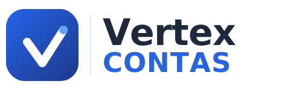
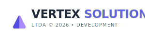
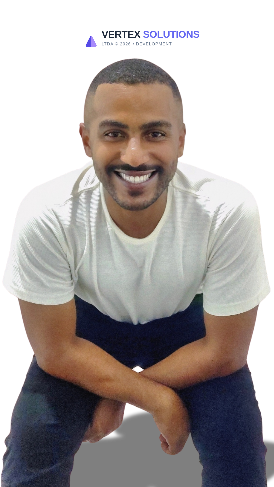

# Vertex Contas &middot; [](https://vertexsolutions.com.br) [](https://laravel.com) [](https://tailwindcss.com) [](https://www.php.net)



> **Vertex Contas** é uma plataforma financeira modular de alta performance, desenvolvida com arquitetura moderna para escalabilidade e robustez.

---

## 🧩 Arquitetura Modular

Este projeto utiliza `nwidart/laravel-modules` para manter o código desacoplado e organizado.

| Módulo              | Descrição                                                                        |
| :------------------ | :------------------------------------------------------------------------------- |
| **🟢 Core**          | Núcleo do sistema, layouts base, componentes globais e configurações essenciais. |
| **🏠 HomePage**      | Landing page, apresentação pública e roteamento inicial.                         |
| **🛡️ PanelAdmin**    | Painel administrativo para gestão total do sistema e usuários.                   |
| **👤 PanelUser**     | Painel do cliente final para gestão de contas e serviços.                        |
| **🎧 PanelSuporte**  | Central de atendimento e ferramentas para agentes de suporte.                    |
| **🔔 Notifications** | Sistema centralizado de notificações e alertas em tempo real.                    |
| **💳 Gateways**      | Integrações de pagamento (Stripe, Mercado Pago, etc.).                           |
| **📝 Blog**          | Gestão de conteúdo e artigos para SEO e engajamento.                             |

---

## 🛠️ Stack Tecnológica

O projeto foi construído utilizando as tecnologias mais recentes do mercado para garantir performance e manutenibilidade.

### Backend
- **Laravel 12.x**: Framework PHP robusto e moderno.
- **Spatie Permissions**: Controle de acesso (RBAC) granular.
- **SQLite / MySQL**: Banco de dados flexível.

### Frontend
- **Blade & Components**: Motor de templating nativo e eficiente.
- **Tailwind CSS 4.1**: Estilização utility-first com configuração via Vite.
- **Alpine.js 3.x**: Interatividade leve e reativa sem complexidade de build.
- **Font Awesome Pro**: Ícones premium para uma interface visual rica.
- **Vite 7.x**: Bundler de próxima geração para desenvolvimento rápido.

### Componentes Globais Chave
O sistema possui uma biblioteca de componentes padronizados para consistência visual:
- `x-layout-app`: Layout mestre da aplicação.
- `x-icon`: Gerenciador de ícones SVG otimizados.
- `x-logo`: Renderização adaptativa da marca.
- `x-loading-overlay`: Feedback visual de carregamento "Fintech Style".

---

## 🚀 Como Executar

Siga os passos abaixo para configurar o ambiente de desenvolvimento local.

### Pré-requisitos
- PHP 8.2+
- Composer
- Node.js & NPM
- Servidor Web (Apache/Nginx) ou `php artisan serve`

### Passo a Passo

1. **Clone o repositório**
   ```bash
   git clone https://github.com/RabbitVisual/VertexContas.git
   cd VertexContas
   ```

2. **Instale as dependências**
   ```bash
   composer install
   npm install
   ```

3. **Configure o ambiente**
   ```bash
   cp .env.example .env
   php artisan key:generate
   ```
   *Configure seu banco de dados no arquivo `.env`.*

4. **Migrações e Seeds**
   ```bash
   php artisan migrate --seed
   ```

5. **Execute a aplicação**
   *Terminal 1 (Backend):*
   ```bash
   php artisan serve
   ```
   *Terminal 2 (Frontend - Hot Reload):*
   ```bash
   npm run dev
   ```

Acesse: `http://localhost:8000`

---

## 🎨 Identidade Visual (Assets)

Os recursos visuais oficiais do projeto estão localizados em `storage/app/public/`:

- **Favicon:** `logos/favicon.svg`
- **Logo Principal:** `logos/logo.svg`
- **Logo Branca (Dark Mode):** `logos/logo-white.svg`
- **Logo Corporativa:** `business/vertex_solutions_logo.svg`

---

<!-- Credits Footer -->
<div align="center">
  <br>
  

  <h3>🏢 Sobre a Empresa</h3>
  <p>A <b>Vertex Solutions LTDA</b> é referência em desenvolvimento de softwares corporativos e soluções web de alto nível.</p>

  <br>

  <!-- Developer Profile -->
  <a href="https://github.com/RabbitVisual/">
    
  </a>
  <h3>Reinan Rodrigues</h3>
  <p><b>CEO / Lead Architect</b></p>

  <br>

  <sub>© 2026 Vertex Solutions LTDA • Todos os direitos reservados.</sub>
</div>
