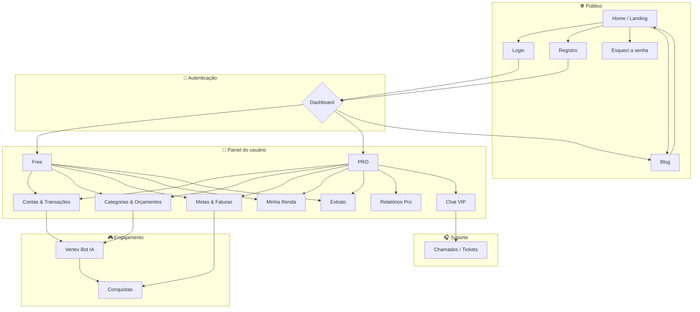
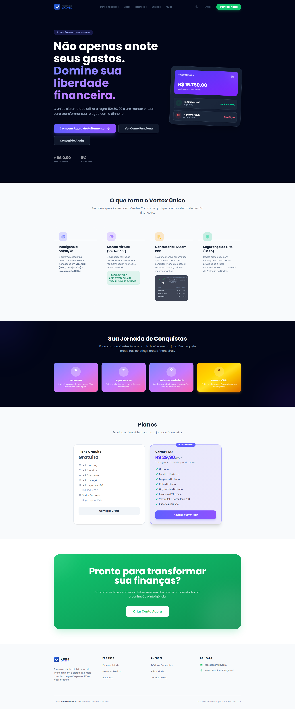
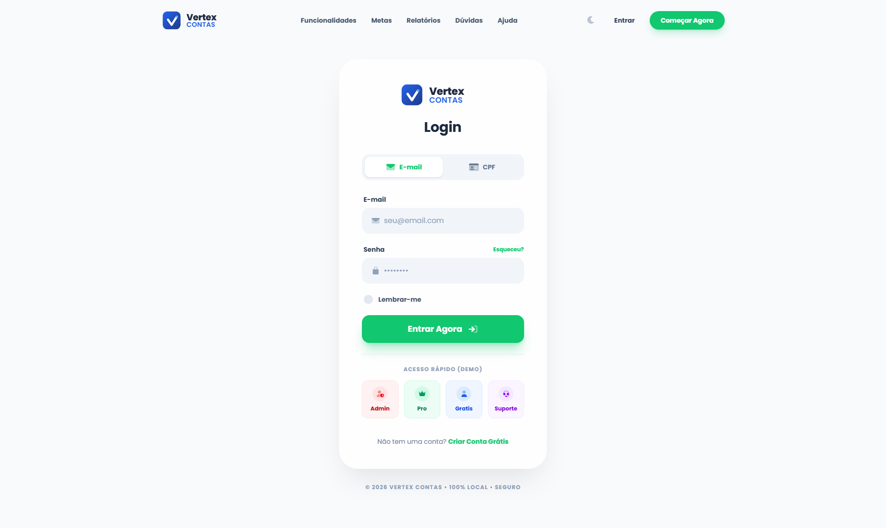
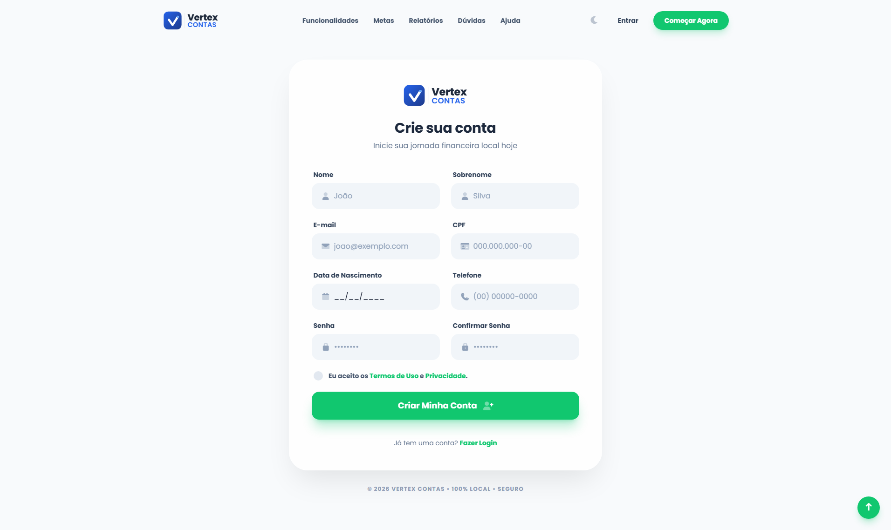
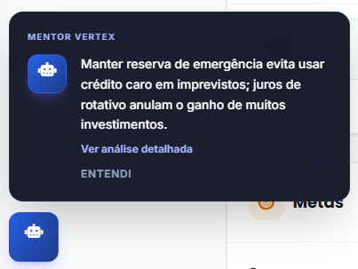

# Vertex Contas &middot; [](https://vertexsolutions.com.br) [](https://laravel.com) [](https://tailwindcss.com) [](https://www.php.net)


> **Vertex Contas** é uma plataforma financeira modular de alta performance, desenvolvida com arquitetura moderna para escalabilidade e robustez.

---

## 🧩 Arquitetura Modular

Este projeto utiliza `nwidart/laravel-modules` para manter o código desacoplado e organizado. Cada módulo fica em `Modules/{NomeDoModulo}/`.

| Módulo              | Descrição                                                                        |
| :------------------ | :------------------------------------------------------------------------------- |
| **🟢 Core**          | Núcleo financeiro: dashboard, relatórios, projeções, saúde financeira, consultoria PDF e integração com IA (Gemini). |
| **🏠 HomePage**      | Landing page, login, registro, recuperação de senha e apresentação pública.       |
| **🛡️ PanelAdmin**    | Painel administrativo: gestão de usuários, configurações (e-mail, Gemini, branding) e visão geral do sistema. |
| **👤 PanelUser**     | Painel do cliente: contas, transações, categorias, orçamentos, metas, faturas, renda e plano/assinatura. |
| **🎧 PanelSuporte**  | Central de atendimento: chamados (tickets), ferramentas para agentes de suporte.   |
| **🔔 Notifications** | Notificações in-app e canais centralizados.                                      |
| **💳 Gateways**      | Integrações de pagamento (webhooks, upgrade PRO) e processamento de assinaturas.  |
| **📝 Blog**          | Gestão de conteúdo, artigos para SEO e engajamento (público e premium).           |
| **🎮 Gamification**  | Vertex Bot (mentor IA), conquistas, insights didáticos e score financeiro.       |
| **💬 VertexChat**    | Chat VIP em tempo real para assinantes PRO e suporte.                            |

---

## 🛠️ Stack Tecnológica

O projeto foi construído utilizando as tecnologias mais recentes do mercado para garantir performance e manutenibilidade.

### Backend
- **Laravel 12.x**: Framework PHP robusto e moderno.
- **Spatie Permissions**: Controle de acesso (RBAC) granular.
- **SQLite / MySQL**: Banco de dados flexível.

### Frontend
- **Blade & Components**: Motor de templating nativo e eficiente.
- **Tailwind CSS 4.1**: Estilização utility-first com configuração via Vite.
- **Alpine.js 3.x**: Interatividade leve e reativa sem complexidade de build.
- **Font Awesome Pro**: Ícones premium para uma interface visual rica.
- **Vite 7.x**: Bundler de próxima geração para desenvolvimento rápido.

### Componentes Globais Chave
O sistema possui uma biblioteca de componentes padronizados para consistência visual:
- `x-layout-app`: Layout mestre da aplicação.
- `x-icon`: Gerenciador de ícones SVG otimizados.
- `x-logo`: Renderização adaptativa da marca.
- `x-loading-overlay`: Feedback visual de carregamento "Fintech Style".

---

## 🚀 Como Executar

Siga os passos abaixo para configurar o ambiente de desenvolvimento local.

### Pré-requisitos
- PHP 8.2+
- Composer
- Node.js & NPM
- Servidor Web (Apache/Nginx) ou `php artisan serve`

### Passo a Passo

1. **Clone o repositório**
   ```bash
   git clone https://github.com/RabbitVisual/VertexContas.git
   cd VertexContas
   ```

2. **Instale as dependências**
   ```bash
   composer install
   npm install
   ```

3. **Configure o ambiente**
   ```bash
   cp .env.example .env
   php artisan key:generate
   ```
   *Configure seu banco de dados no arquivo `.env`.*

4. **Migrações e Seeds**
   ```bash
   php artisan migrate --seed
   ```

5. **Execute a aplicação**
   *Terminal 1 (Backend):*
   ```bash
   php artisan serve
   ```
   *Terminal 2 (Frontend - Hot Reload):*
   ```bash
   npm run dev
   ```

Acesse: `http://localhost:8000`

---

## 📧 E-mails e Fila (Produção / Hostinger)

Os e-mails (boas-vindas, reset de senha, confirmação PRO) e notificações são enviados via fila. **É vital** configurar o Cron na Hostinger para que a fila seja processada.

Para um checklist completo de deploy (ambiente, cache, storage, frontend, cron e validação pós-deploy), consulte **[docs/DEPLOY.md](docs/DEPLOY.md)**.

1. **Queue:** No `.env`, defina `QUEUE_CONNECTION=database`.
2. **Cron Job (obrigatório):** No painel da Hostinger, adicione um Cron que rode **a cada minuto**:
   ```bash
   * * * * * cd /caminho/absoluto/do/projeto && php artisan schedule:run >> /dev/null 2>&1
   ```
   O `schedule:run` executa automaticamente o `queue:work --stop-when-empty --max-time=55` a cada minuto (definido em `routes/console.php`), além de outras tarefas agendadas (ex.: transações recorrentes diárias).

---

## 🎨 Identidade Visual (Assets)

Os recursos visuais oficiais do projeto estão localizados em `storage/app/public/`:

- **Favicon:** `logos/favicon.svg`
- **Logo Principal:** `logos/logo.svg`
- **Logo Branca (Dark Mode):** `logos/logo-white.svg`
- **Logo Corporativa:** `business/vertex_solutions_logo.svg`

---

## 📐 Fluxograma do sistema

Visão geral do fluxo do usuário na plataforma (do acesso inicial ao uso dos módulos):


```mermaid
flowchart TB
  subgraph Publico["🌐 Público"]
    A[Home / Landing]
    A --> B[Login]
    A --> C[Registro]
    A --> D[Esqueci a senha]
    A --> E[Blog]
  end

  subgraph Auth["🔐 Autenticação"]
    B --> F{Dashboard}
    C --> F
  end

  subgraph User["👤 Painel do usuário"]
    F --> G[Free]
    F --> H[PRO]
    G --> I[Contas & Transações]
    G --> J[Categorias & Orçamentos]
    G --> K[Metas & Faturas]
    G --> L[Minha Renda]
    G --> M[Extrato]
    H --> I
    H --> J
    H --> K
    H --> L
    H --> M
    H --> N[Relatórios Pro]
    H --> O[Chat VIP]
  end

  subgraph Engajamento["🎮 Engajamento"]
    I --> P[Vertex Bot IA]
    J --> P
    K --> Q[Conquistas]
    P --> Q
  end

  subgraph Suporte["🎧 Suporte"]
    O --> R[Chamados / Tickets]
  end

  E --> A
  F --> E
```

---

## 📸 Galeria do sistema

Prints de tela oficiais do Vertex Contas. Cada imagem está em `public/images/system/` com nome que descreve a tela — ao rolar a página você vê o print e a descrição abaixo.

---

### 🏠 Página inicial e autenticação

#### Home (Landing)

*Página inicial pública: apresentação da plataforma, benefícios e call-to-action para login ou registro.*

#### Login

*Tela de login: acesso com e-mail e senha para usuários já cadastrados.*

#### Registro

*Tela de registro: criação de nova conta no Vertex Contas.*

#### Esqueceu a senha

*Recuperação de senha: fluxo "Esqueci minha senha" com envio de link por e-mail.*

---

### 📊 Dashboard (Free e PRO)

#### Dashboard — Usuário Free

*Dashboard do plano gratuito: visão geral financeira, métricas e dicas do Vertex Bot.*

#### Dashboard — Usuário PRO

*Dashboard do plano PRO: mesma base com recursos adicionais e indicadores avançados.*

#### Dashboard — Opção de esconder Vertex Bot

*Dashboard com a opção "Esconder Vertex Bot" ativa, para quem prefere interface mais limpa.*

#### Home após login — Free

*Home/landing exibida para o usuário free após o login.*

#### Home após login — PRO

*Home/landing exibida para o usuário PRO após o login.*

---

### 💼 Gestão financeira

#### Minhas contas (PRO)

*Gestão de contas bancárias/carteiras no plano PRO.*

#### Minhas categorias

*Gestão de categorias de receitas e despesas.*

#### Categorias (PRO)

*Tela de categorias com recursos do plano PRO.*

#### Meus orçamentos (PRO)

*Orçamentos por categoria no plano PRO.*

#### Minhas metas

*Metas financeiras: cadastro e acompanhamento de objetivos com valor e prazo.*

#### Minhas metas (PRO)

*Metas com recursos avançados no plano PRO.*

#### Minhas faturas

*Tela de faturas: visão de compromissos e vencimentos.*

#### Minha renda

*Cadastro e gestão de fontes de renda (salário, freelance, etc.).*

#### Seu extrato mensal

*Extrato mensal: lançamentos e saldo do período.*

---

### 📈 Relatórios, planos e blog

#### Relatório PRO

*Relatórios avançados disponíveis para assinantes PRO.*

#### Planos e assinatura

*Tela de planos e assinatura: comparação Free x PRO e upgrade.*

#### Blog Vertex

*Blog: listagem de artigos para educação financeira e SEO.*

---

### 🤖 Vertex Bot e gamificação

#### Vertex Bot

*Vertex Bot: mentor financeiro com dicas contextuais e integração opcional com IA (Gemini).*

#### Vertex Bot (variação)

*Vertex Bot em outro contexto de dica (ex.: orçamento, poupança ou dica do dia).*

#### Página de conquistas

*Gamificação: conquistas desbloqueadas e progresso do usuário.*

---

### 🎧 Suporte e Chat VIP

#### Seus chamados (Tickets)

*Central de chamados: tickets de suporte abertos e histórico.*

#### Chat VIP — Suporte em tempo real (PRO)

*Chat VIP em tempo real para assinantes PRO e equipe de suporte.*

---

### ⏳ Experiência do usuário

#### Loading overlay

*Overlay de carregamento no estilo fintech durante processamento.*

---

*Todos os prints ficam em `public/images/system/`. Para adicionar novos: salve o PNG com nome descritivo da tela (ex.: `Nova funcionalidade X.png`).*

---

## ✨ Funcionalidades e melhorias

O Vertex Contas hoje oferece:

- **Gestão financeira completa:** contas, transações, categorias, orçamentos por categoria e metas com prazo.
- **Regra 50/30/20:** acompanhamento de necessários, desejos e poupança com métricas e relatórios.
- **Vertex Bot (IA):** mentor financeiro com dicas contextuais (Gemini opcional), insights por evento (saldo baixo, orçamento, poupança, dica do dia) e opção de esconder o assistente.
- **Gamificação:** conquistas, score financeiro e banco de insights didáticos/profissionais (seeders).
- **Planos Free e PRO:** assinatura PRO com Chat VIP, relatórios avançados, consultoria PDF e conteúdos premium.
- **Blog:** artigos públicos e premium para SEO e educação financeira.
- **Suporte:** central de chamados (tickets) e chat em tempo real para PRO.
- **E-mails transacionais:** boas-vindas, reset de senha e confirmação PRO, com template único e fila (queue).
- **Configurações dinâmicas (Admin):** driver de e-mail (SMTP, SES, etc.), teste de envio, API Gemini e branding (logo, nome).
- **Relatórios e consultoria:** análise de saúde financeira e geração de PDF de consultoria com conclusão via IA.

---

<!-- Credits Footer -->
<div align="center">
  <br>
  

  <h3>🏢 Sobre a Empresa</h3>
  <p>A <b>Vertex Solutions LTDA</b> é referência em desenvolvimento de softwares corporativos e soluções web de alto nível.</p>

  <br>

  <!-- Developer Profile -->
  <a href="https://github.com/RabbitVisual/">
    
  </a>
  <h3>Reinan Rodrigues</h3>
  <p><b>CEO / Lead Architect</b></p>

  <br>

  <sub>© 2026 Vertex Solutions LTDA • Todos os direitos reservados.</sub>
</div>
